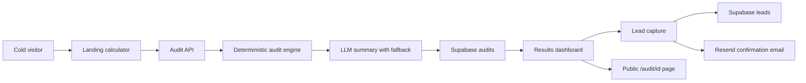

# Architecture

## Data Flow

The user selects tools, plans, monthly spend, seats, team size, and primary use case. The browser persists the form in localStorage, then posts the input to `/api/audits`. The server validates the payload, runs deterministic audit rules, asks the LLM for a short summary, falls back to a template if needed, stores the anonymized audit result, and returns the result for display.

Email capture happens after the result is shown. `/api/leads` stores the lead, applies a honeypot and one-minute duplicate guard, and sends a Resend confirmation email when configured.

## Stack Choice

Next.js App Router gives server routes, public dynamic pages, and metadata generation in one deployable app. TypeScript keeps the pricing catalog and audit engine harder to misuse. Supabase is used for real backend storage, Resend for transactional email, and Anthropic/Vercel AI SDK-compatible generation for the required personalized paragraph.

## 10k Audits/Day

I would move rate limiting to Redis or Upstash, add queue-based email delivery, cache public audit pages, store pricing as versioned rows, add structured logs, and separate PII-bearing leads from public audit payloads with stricter table policies.
