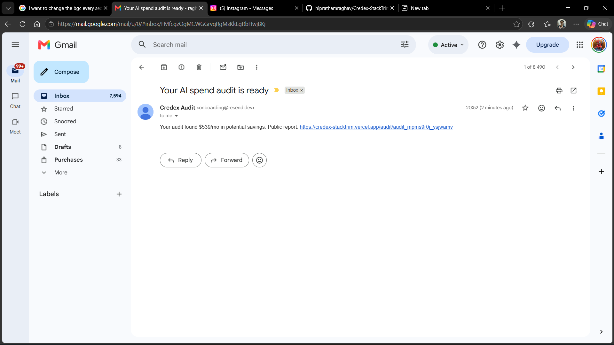

# StackTrim

StackTrim is a free AI spend audit tool for startup founders and engineering managers who pay for Cursor, Claude, ChatGPT, Copilot, Gemini, Windsurf, or direct API usage. It shows plan-fit issues, credible downgrade/switch opportunities, annual savings, and high-savings Credex consultation prompts without requiring login before value is shown.

Live URL: https://credex-stacktrim.vercel.app

## Screenshots

30-second walkthrough:

[StackTrim product walkthrough](public/media/stacktrim-walkthrough.mp4)

The recording shows:

- Landing calculator
- Audit results dashboard
- Public share and lead capture area

Resend confirmation email:



## Quick Start

```bash
npm install
cp .env.example .env.local
npm run dev
```

Open `http://localhost:3000`.

## Deploy

Deploy on Vercel, then add these environment variables: `NEXT_PUBLIC_SITE_URL`, `NEXT_PUBLIC_SUPABASE_URL`, `SUPABASE_SERVICE_ROLE_KEY`, `RESEND_API_KEY`, `RESEND_FROM_EMAIL`, and either `GEMINI_API_KEY` or `ANTHROPIC_API_KEY`.

Create Supabase tables named `audits` and `leads` with JSON columns for audit input/result and standard text columns for lead fields.

Production has been verified with Supabase audit storage, Gemini summaries, public share URLs, lead capture, and Resend confirmation email.

## Decisions

1. I used Next.js App Router because shareable audit URLs and Open Graph metadata are core requirements.
2. I kept audit math deterministic because pricing recommendations need to be auditable and defensible.
3. I used AI only for the personalized summary so failures do not affect savings calculations.
4. I chose Supabase and Resend because they are fast to set up, production-like, and common enough for reviewers to understand.
5. I used a calculator-led landing page instead of a marketing-only homepage because cold visitors should reach value immediately.
